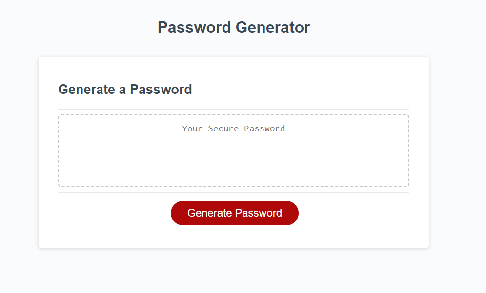

# Password-Genrator

## Description

Provide a short description explaining the what, why, and how of your project. Use the following questions as a guide:

I was motivated by this project because I was very eager to learn the fundementals of DOM's and how to creat scripted elements 
in an HTML webpage. I build this project to simply discover how a button can be used to display something on the webpage.
This challenge helped solve the issue on how to create a working button in JavaScript that allows users to generate a random password.
I learned the basic fundamentals of DOM's and how to connect JavaScript to my HTML file. 

-
## Installation
N/A

## Usage

Press "generate password" to randomly generate a 16 charcter password

   

   

    

## Credits

N/A

## License
Refer to Github repo